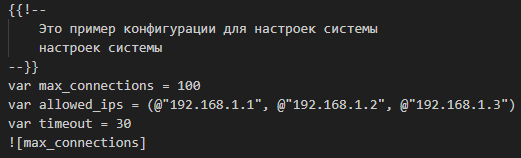
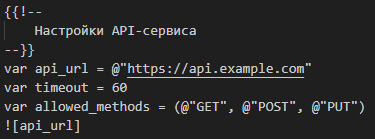
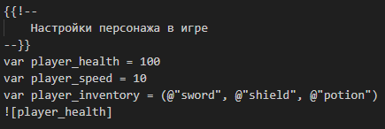
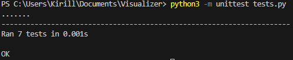

# Parser
Третье домашнее задание по Конфигурационному Управлению

## Постановка задачи

### Задание №1
Разработать инструмент командной строки для учебного конфигурационного 
языка, синтаксис которого приведен далее. Этот инструмент преобразует текст из 
входного формата в выходной. Синтаксические ошибки выявляются с выдачей 
сообщений. 
Входной текст на языке xml принимается из файла, путь к которому задан 
ключом командной строки. Выходной текст на учебном конфигурационном 
языке попадает в файл, путь к которому задан ключом командной строки.

Многострочные комментарии:

{{!-- 
  Это многострочный 
  комментарий 
--}}

Массивы:

  ({ значение, значение, значение, ... })
  
Имена:

[a-zA-Z]+

Значения: 
- Числа. 
- Строки. 
- Массивы.

Строки: 

@"Это строка"

Объявление константы на этапе трансляции:

var имя = значение

Вычисление константы на этапе трансляции:

![имя]

Результатом вычисления константного выражения является значение. 
Все конструкции учебного конфигурационного языка (с учетом их 
возможной вложенности) должны быть покрыты тестами. Необходимо показать 3 
примера описания конфигураций из разных предметных областей. 

Для запуска ввести в консоль: 

```python3 parser.py <input_xml_file> <output_config_file>""```

Для запуска тестов ввести в консоль: 

```python3 -m unittest tests.py```

## Описание алгоритма

Программа предназначена для преобразования XML-файла в текстовый файл на "кастомном языке", использующем специальные синтаксисы для комментариев, констант, массивов и выражений. Рассмотрим шаг за шагом её работу.

1. Основные импорты и регулярные выражения:
  - sys: Модуль для работы с системными параметрами, такими как аргументы командной строки.
  - xml.etree.ElementTree as ET: Модуль для парсинга XML.
  - re: Модуль для работы с регулярными выражениями, используется для замены строк в тексте.

В программе также определены регулярные выражения для работы с различными типами данных:

- COMMENT_BLOCK: Для поиска и обработки блоков комментариев в стиле {{!-- комментарий --}}.
- ARRAY: Для поиска массивов, представленных как ( элемент1, элемент2, ... ).
- STRING: Для поиска строк в кавычках @"строка".
- NUMBER: Для поиска целых чисел.
- CONST_DECLARATION: Для поиска определения констант вида var имя = значение;.
- CONST_EVALUATION: Для поиска выражений типа ![имя].

Также создаётся пустой словарь constants, который, однако, не используется в этой версии программы.

2. Функция parse_xml:
Эта функция занимается обработкой XML-строки и преобразованием её в текст на кастомном языке.

- Парсинг XML: Используется ET.fromstring(input_xml) для преобразования XML-строки в дерево элементов.
Для каждого элемента XML выполняется следующее:
- Если элемент — комментарий (<comment>):
- Извлекается текст комментария, разделённый на строки.
- Каждая строка добавляется в выходной текст с нужным форматированием {{!-- ... --}}.
- Если элемент — константа (<constant>):
- Извлекается атрибут name и текст элемента (значение).
- Добавляется строка вида var имя = значение.
- Если элемент — массив (<array>):
- Извлекаются все элементы <item>, из которых формируется строка с массивом вида ( элемент1, элемент2, ... ).
- Если элемент — выражение (<evaluation>):
- Извлекается атрибут name и текст, который в дальнейшем форматируется как ![имя].
- Если элемент не соответствует этим тегам:
- Выводится сообщение об ошибке с неправильным тегом.
- Результат обработки каждого элемента добавляется в список output_lines, который затем преобразуется в строку и возвращается.

3. Функция convert_xml_to_custom_language:
Эта функция управляет процессом преобразования XML-файла в текстовый файл на кастомном языке.

- Открывает входной XML-файл по пути, переданному в аргументе командной строки.
- Парсит его через функцию parse_xml.
- Использует регулярные выражения, чтобы заменить все строки, заключённые в кавычки, на формат @"строка".
- Открывает выходной файл и записывает преобразованный текст.
- Выводит сообщение о том, что преобразование прошло успешно, или сообщение об ошибке, если что-то пошло не так.

4. Функция main:
В этой функции выполняется обработка аргументов командной строки:

- Проверяется, что переданы два аргумента: путь к входному файлу и путь к выходному файлу.
- Если количество аргументов неправильное, выводится инструкция по использованию.
- Если аргументы верны, вызывается функция convert_xml_to_custom_language, которая выполняет все этапы преобразования.

## Тестирование программы

1. Тест файла ip.xml:



2. Тест файла quote.xml:



3. Тест файла game.xml:



4. Unittest:


